## Penjelasan
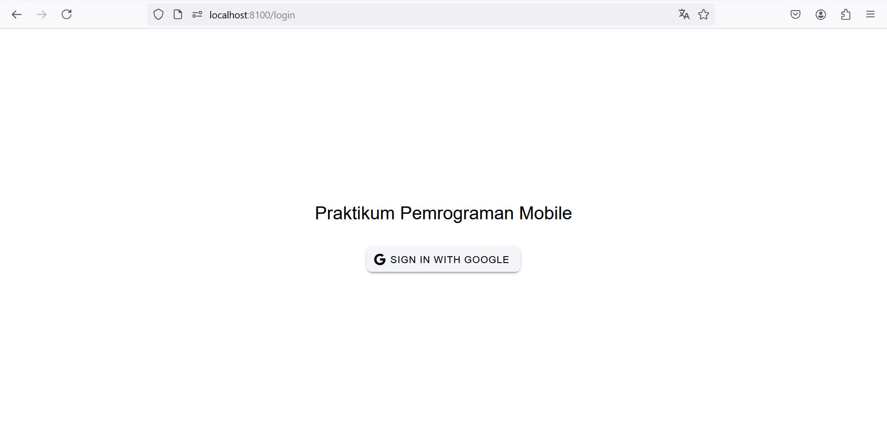
<template>
  <ion-page>
    <ion-content :fullscreen="true">
      

        <!-- Title -->
        <ion-text style="margin-bottom: 20px; text-align: center">
          <h1>Praktikum Pemrograman Mobile</h1>
        </ion-text>

        <!-- Button Sign In -->
        <ion-button @click="login" color="light">
          <ion-icon slot="start" :icon="logoGoogle"></ion-icon>
          <ion-label>Sign In with Google</ion-label>
        </ion-button>
      

    </ion-content>
  </ion-page>
</template>

1. Proses yang Terjadi
- Rendering Halaman:
        Saat halaman dimuat, template ditampilkan:
            Judul halaman muncul di tengah layar.
            Tombol login dengan ikon Google tampil di bawah judul.

- Interaksi Pengguna:
        Pengguna mengklik tombol Sign In with Google.
        Event @click="login" dipicu, dan fungsi login() dijalankan.

- Proses Login:
        Fungsi login() memanggil authStore.loginWithGoogle():
            Proses autentikasi Google dimulai (biasanya menggunakan Firebase Authentication atau library lain).
            Setelah login berhasil, aplikasi dapat menyimpan informasi pengguna, misalnya nama, email, atau token autentikasi.

- Respons Autentikasi:
        Jika login berhasil:
            Informasi pengguna diperbarui di store (authStore), yang dapat diakses di seluruh aplikasi.
        Jika login gagal:
            Error akan ditangani sesuai dengan implementasi di loginWithGoogle() (tidak diperlihatkan di kode ini).
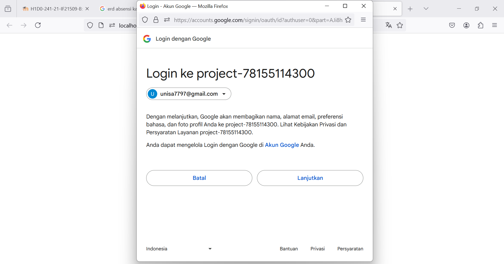
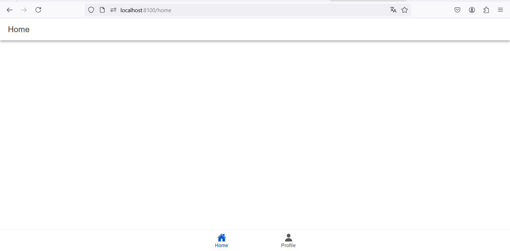
<template>
  <ion-page>
    <ion-header :translucent="true">
      <ion-toolbar>
        <ion-title>Home</ion-title>
      </ion-toolbar>
    </ion-header>

    <ion-content :fullscreen="true">
      

      <TabsMenu />
    </ion-content>
  </ion-page>
</template>

1. Struktur Template
- Tag <template>: Mendefinisikan struktur HTML dari komponen.
- Tag <ion-page>: Komponen utama dari Ionic yang membungkus seluruh halaman aplikasi.
- Tag <ion-header>: Bagian header dari halaman yang biasanya digunakan untuk menampilkan judul atau navigasi.
        - Properti :translucent="true": Menjadikan header terlihat transparan dengan sedikit efek buram.
- Tag <ion-toolbar>: Komponen toolbar di dalam header untuk menampung elemen-elemen seperti judul.
        - Tag <ion-title>: Menampilkan teks "Home" sebagai judul halaman.
- Tag <ion-content>: Area utama untuk menampilkan konten halaman.
        - Properti :fullscreen="true": Mengatur agar konten menggunakan seluruh tinggi layar, termasuk area di bawah header jika diperlukan.
- Tag <TabsMenu />: Komponen custom (didefinisikan di file @/components/TabsMenu.vue) yang kemungkinan berfungsi sebagai menu tab navigasi untuk aplikasi.
2. Proses yang Terjadi
- Saat Aplikasi Dimuat:
        Vue akan memproses file ini sebagai komponen tunggal dengan template, script, dan style.
- Rendering Komponen:
        Elemen-elemen Ionic seperti IonHeader dan IonContent akan dirender sebagai bagian dari struktur halaman.
        Komponen custom TabsMenu akan dimasukkan di posisi <TabsMenu />, memuat menu navigasi atau elemen lain sesuai definisinya.
- Interaksi Pengguna:
        Header akan menampilkan judul "Home".
        TabsMenu memungkinkan pengguna untuk berinteraksi dengan menu navigasi (kemungkinan berpindah halaman/tab).
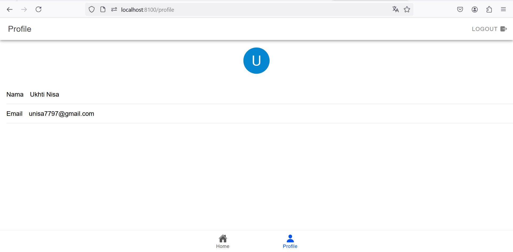
<template>
  <ion-page>
    <ion-header :translucent="true">
      <ion-toolbar>
        <ion-title>Profile</ion-title>

        <!-- Logout Button -->
        <ion-button
          slot="end"
          fill="clear"
          @click="logout"
          style="--color: gray"
        >
          <ion-icon slot="end" :icon="exit"></ion-icon>
          <ion-label>Logout</ion-label>
        </ion-button>
      </ion-toolbar>
    </ion-header>

    <ion-content :fullscreen="true">
      <!-- Avatar -->
      

        <ion-avatar>
          
        </ion-avatar>
      

      <!-- Data Profile -->
      <ion-list>
        <ion-item>
          <ion-input
            label="Nama"
            :value="user?.displayName"
            :readonly="true"
          ></ion-input>
        </ion-item>

        <ion-item>
          <ion-input
            label="Email"
            :value="user?.email"
            :readonly="true"
          ></ion-input>
        </ion-item>
      </ion-list>

      <!-- Tabs Menu -->
      <TabsMenu />
    </ion-content>
  </ion-page>
</template>

1. Proses yang Terjadi
- Saat Halaman Dimuat:
        Data Pengguna: Data diambil dari authStore.
        Avatar: URL foto profil pengguna diambil. Jika kosong, akan menggunakan gambar default.
- Rendering Konten:
        Header ditampilkan dengan tombol "Logout".
        Avatar dan data profil (nama dan email) ditampilkan.
        Tabs Menu muncul di bagian bawah.
- Interaksi Pengguna:
        Logout: Jika tombol logout diklik, fungsi logout() dipanggil untuk menghapus sesi pengguna.
- Fallback Avatar:
        Jika gambar profil gagal dimuat, handleImageError() mengganti URL ke gambar default.

  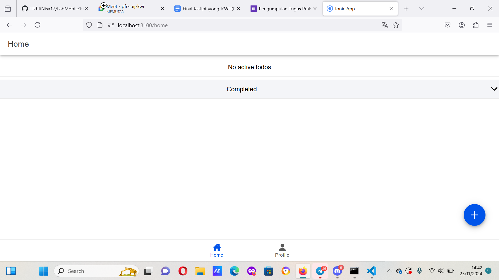
  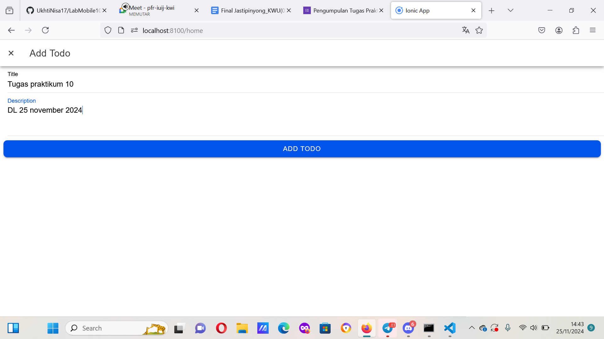
  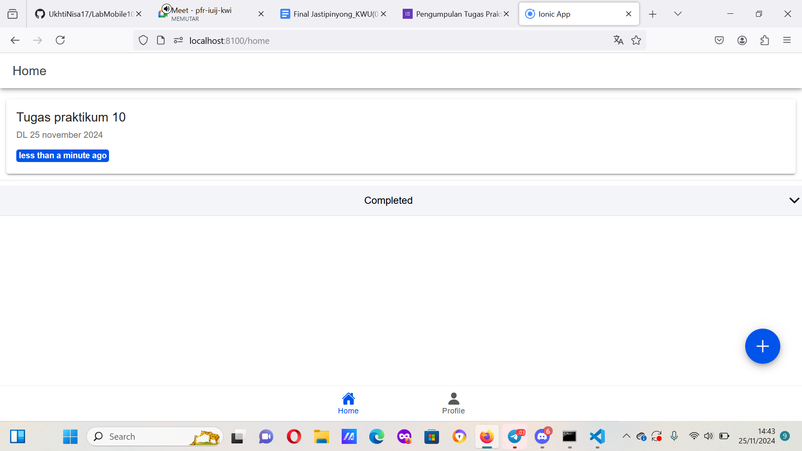
  Fungsi untuk menambahkan todo baru dimulai dari membuka form input, menangkap data yang diisi oleh pengguna, hingga menyimpan data ke backend (Firestore) dan menampilkan todo tersebut di halaman Home. Berikut penjelasan detail dari proses add todo:
1. Membuka Form Input untuk Menambah Todo

Pada halaman Home, terdapat tombol FAB (Floating Action Button) untuk membuka form input modal:

<ion-fab vertical="bottom" horizontal="end" slot="fixed">
  <ion-fab-button @click="isOpen = true">
    <ion-icon :icon="add" size="large"></ion-icon>
  </ion-fab-button>
</ion-fab>

    Penjelasan:
        Tombol FAB (ikon add) berfungsi untuk membuka modal input dengan mengubah nilai isOpen menjadi true.
        Ketika isOpen bernilai true, komponen modal InputModal akan muncul.

2. Komponen InputModal

Komponen InputModal digunakan untuk menangkap data yang diisi oleh pengguna. Berikut cara modal dihubungkan ke halaman Home:

<InputModal
  v-model:isOpen="isOpen"
  v-model:editingId="editingId"
  :todo="todo"
  @submit="handleSubmit"
/>

    Fungsi:
        v-model:isOpen: Mengontrol apakah modal terbuka atau tidak.
        v-model:editingId: Digunakan untuk mengedit todo jika ada ID (dalam kasus ini kosong untuk add todo).
        :todo: Data kosong yang disiapkan untuk menampung input pengguna.
        @submit: Ketika tombol submit pada modal ditekan, fungsi handleSubmit akan dipanggil.

3. Menangani Submit Todo Baru

Fungsi handleSubmit menangani proses penyimpanan todo baru ke backend.

const handleSubmit = async (
  todo: Omit<Todo, "id" | "createdAt" | "updatedAt" | "status">
) => {
  if (!todo.title) {
    await showToast("Title is required", "warning", warningOutline); // Validasi jika title kosong
    return;
  }
  try {
    if (editingId.value) {
      // Jika ada ID, berarti ini adalah proses edit
      await firestoreService.updateTodo(editingId.value, todo as Todo);
      await showToast("Todo updated successfully", "success", checkmarkCircle);
    } else {
      // Proses menambahkan todo baru
      await firestoreService.addTodo(todo as Todo); // Menyimpan todo ke Firestore
      await showToast("Todo added successfully", "success", checkmarkCircle); // Menampilkan notifikasi sukses
    }
    loadTodos(); // Memuat ulang daftar todo untuk menampilkan perubahan
  } catch (error) {
    await showToast("An error occurred", "danger", closeCircle); // Menangani kesalahan
    console.error(error);
  } finally {
    editingId.value = null; // Reset editing ID
  }
};

Penjelasan Proses:

    Validasi Input:
        Jika pengguna tidak mengisi title, akan muncul pesan peringatan "Title is required".
    Penyimpanan Data Baru:
        Fungsi firestoreService.addTodo digunakan untuk menyimpan todo baru ke backend Firestore.
        Todo baru akan memiliki properti berikut:
            title: Diisi dari input pengguna.
            description: Diisi dari input pengguna.
            status: Default-nya false (active).
            createdAt dan updatedAt: Timestamp penyimpanan di Firestore.
    Notifikasi:
        Menampilkan pesan "Todo added successfully" kepada pengguna jika todo berhasil disimpan.
    Memuat Ulang Daftar Todo:
        Fungsi loadTodos dipanggil untuk mengambil data todo terbaru dari backend, sehingga todo baru akan langsung tampil di halaman Home.

4. Menampilkan Todo Baru di Halaman Home

Setelah todo berhasil disimpan ke Firestore, data baru akan dimuat ke variabel todos dengan fungsi loadTodos:

const loadTodos = async (isLoading = true) => {
  let loading;
  if (isLoading) {
    loading = await loadingController.create({ message: "Loading..." });
    await loading.present();
  }
  try {
    todos.value = await firestoreService.getTodos(); // Mengambil data todo dari Firestore
  } catch (error) {
    console.error(error);
  } finally {
    if (loading) {
      await loading.dismiss();
    }
  }
};

    Fungsi ini mengambil semua data todos dari backend dan memperbarui variabel reaktif todos.
    Setelah todos diperbarui, todo baru secara otomatis akan muncul di daftar Active Todos pada halaman Home.

5. Menampilkan Todo Baru di Daftar Active

Pada template halaman Home, todo baru ditampilkan dalam daftar Active Todos menggunakan perulangan v-for:

<ion-list>
  <ion-item-sliding
    v-for="todo in activeTodos"
    :key="todo.id"
    :ref="(el) => setItemRef(el, todo.id!)"
  >
    <ion-item>
      <ion-card>
        <ion-card-header>
          <ion-card-title class="ion-text-wrap limited-text">{{
            todo.title
          }}</ion-card-title>
          <ion-card-subtitle class="limited-text">{{
            todo.description
          }}</ion-card-subtitle>
        </ion-card-header>
        <ion-card-content>
          <ion-badge>{{ getRelativeTime(todo.updatedAt) }}</ion-badge>
        </ion-card-content>
      </ion-card>
    </ion-item>
  </ion-item-sliding>
</ion-list>

    Perulangan v-for:
        Todo yang statusnya false (active) difilter ke dalam variabel activeTodos dan dirender di daftar ini.
    Properti Todo:
        Title dan Description: Ditampilkan menggunakan elemen <ion-card-title> dan <ion-card-subtitle>.
        Relative Time: Ditampilkan menggunakan fungsi getRelativeTime untuk menunjukkan waktu todo terakhir diperbarui.
  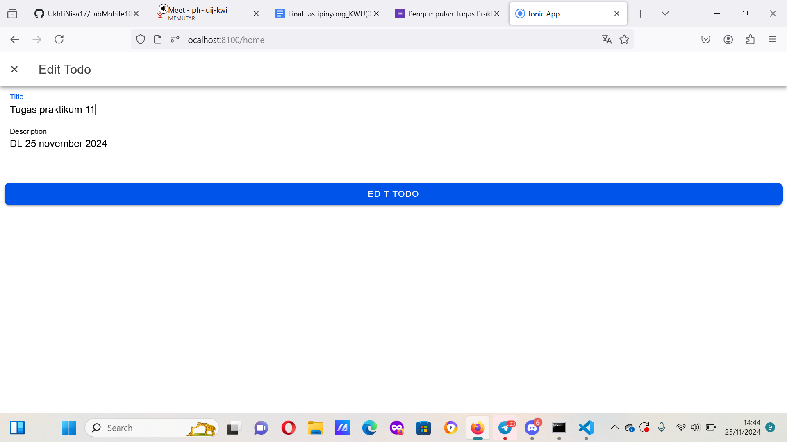
  const handleEdit = async (editTodo: Todo) => {
  const slidingItem = itemRefs.value.get(editTodo.id!);
  await slidingItem?.close(); // Menutup sliding item setelah dipilih untuk diedit

  editingId.value = editTodo.id!; // Menyimpan ID todo yang akan diedit
  todo.value = {
    title: editTodo.title, // Mengisi data form dengan judul todo yang akan diedit
    description: editTodo.description, // Mengisi data form dengan deskripsi todo yang akan diedit
  };
  isOpen.value = true; // Membuka modal input untuk proses editing
};
Fungsi ini dipanggil ketika pengguna mengklik tombol edit pada salah satu todo.
editingId akan diatur ke ID todo yang sedang diedit, sehingga aplikasi tahu mana todo yang harus diperbarui.
todo.value diisi dengan data dari todo yang akan diedit (judul dan deskripsi), yang kemudian ditampilkan di form modal.
isOpen.value = true membuka modal input (InputModal) untuk memungkinkan pengguna mengedit isi todo tersebut.

const handleSubmit = async (
  todo: Omit<Todo, "id" | "createdAt" | "updatedAt" | "status">
) => {
  if (!todo.title) {
    await showToast("Title is required", "warning", warningOutline);
    return;
  }
  try {
    if (editingId.value) {
      await firestoreService.updateTodo(editingId.value, todo as Todo); // Mengupdate todo di Firestore
      await showToast("Todo updated successfully", "success", checkmarkCircle);
    } else {
      await firestoreService.addTodo(todo as Todo); // Menambahkan todo baru jika ID kosong
      await showToast("Todo added successfully", "success", checkmarkCircle);
    }
    loadTodos(); // Memuat ulang daftar todos
  } catch (error) {
    await showToast("An error occurred", "danger", closeCircle);
    console.error(error);
  } finally {
    editingId.value = null; // Menghapus ID editing
  }
};
Jika editingId memiliki nilai, itu berarti pengguna sedang mengedit todo yang ada, sehingga fungsi updateTodo dipanggil untuk memperbarui data di Firestore.
Setelah berhasil, daftar todo diperbarui menggunakan loadTodos().
  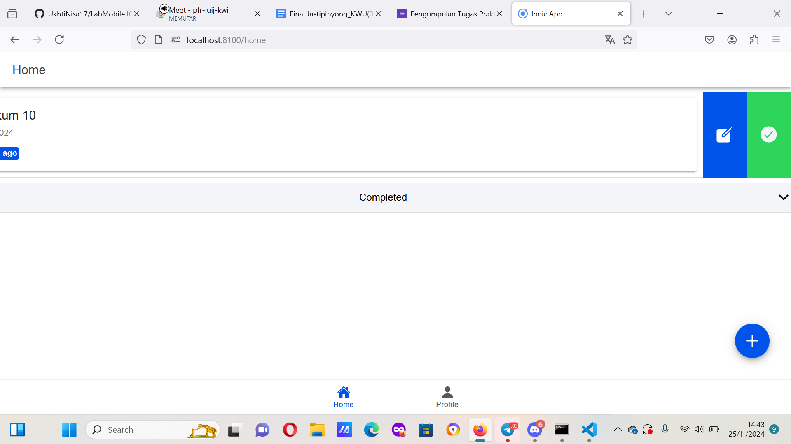
  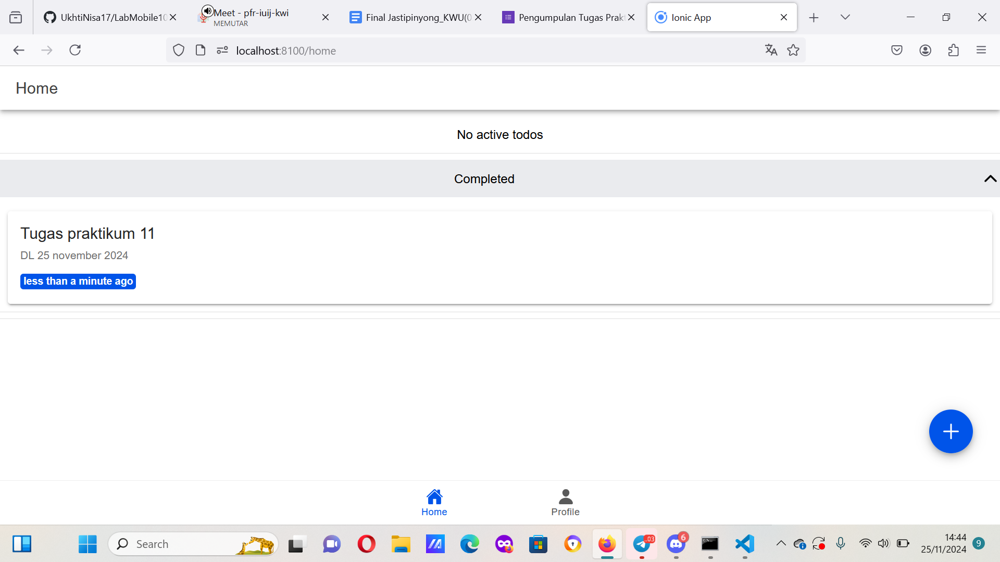
  Fungsi untuk menangani perubahan status todo menjadi "completed" atau "active" diimplementasikan melalui handleStatus. Berikut adalah penjelasan rinci dari fungsi ini dan elemen yang menghubungkannya dengan antarmuka pengguna.
1. Fungsi handleStatus

Fungsi handleStatus bertugas untuk mengubah status sebuah todo. Status ini menunjukkan apakah todo sudah selesai (completed) atau belum (active).

const handleStatus = async (statusTodo: Todo) => {
  const slidingItem = itemRefs.value.get(statusTodo.id!); // Mendapatkan referensi elemen yang sedang diproses
  await slidingItem?.close(); // Menutup elemen sliding setelah selesai dipilih

  try {
    await firestoreService.updateStatus(statusTodo.id!, !statusTodo.status); // Membalikkan status todo (completed <-> active)
    await showToast(
      `Todo marked as ${!statusTodo.status ? "completed" : "active"}`, // Menampilkan notifikasi perubahan status
      "success",
      checkmarkCircle
    );
    loadTodos(); // Memuat ulang daftar todo dari database untuk memastikan sinkronisasi data
  } catch (error) {
    await showToast("Failed to update status", "danger", closeCircle); // Menampilkan pesan kesalahan jika ada masalah
    console.error(error);
  }
};

Penjelasan Langkah-Langkah Fungsi:

    Tutup Elemen Sliding: Fungsi menutup elemen geser (sliding) untuk memastikan elemen kembali ke posisi awal setelah status diubah.

    Perubahan Status:
        Status todo diperbarui melalui firestoreService.updateStatus.
        Nilai status sebelumnya dibalikkan menggunakan !statusTodo.status, sehingga jika status sebelumnya false (active), akan diubah menjadi true (completed), dan sebaliknya.

    Notifikasi:
        Jika operasi berhasil, showToast akan menampilkan pesan keberhasilan seperti "Todo marked as completed" atau "Todo marked as active".
        Jika operasi gagal, pesan error akan ditampilkan kepada pengguna.

    Muat Ulang Data: Daftar todo dimuat ulang menggunakan loadTodos() untuk memperbarui tampilan sesuai data terbaru di database.

2. Elemen pada Template

Fungsi ini dihubungkan dengan tombol complete pada template menggunakan atribut @click.

<ion-item-options side="end" @ionSwipe="handleStatus(todo)">
  <ion-item-option
    color="success"
    expandable
    @click="handleStatus(todo)"
  >
    <ion-icon
      slot="icon-only"
      :icon="checkmarkCircle"
      color="light"
      size="large"
    ></ion-icon>
  </ion-item-option>
</ion-item-options>

    Letak Tombol Complete:
        Tombol complete berada di dalam elemen <ion-item-options>, di bagian kanan setiap item todo.
        Ketika tombol ini diklik, fungsi handleStatus(todo) akan dipanggil untuk mengubah status todo.

    Ikon: Ikon yang digunakan adalah checkmarkCircle, dengan warna hijau (success) untuk menandakan bahwa todo telah selesai.

3. Mekanisme Pengubahan Status
Ketika fungsi dijalankan, perubahan status terjadi di database (Firestore) dan tampilan diperbarui sesuai dengan status baru. Berikut adalah dua skenario:
a. Todo Menjadi Completed
    Jika statusTodo.status adalah false (active), maka status akan diubah menjadi true (completed).
    Todo tersebut akan berpindah dari daftar Active Todos ke daftar Completed Todos.

b. Todo Menjadi Active
    Jika statusTodo.status adalah true (completed), maka status akan diubah menjadi false (active).
    Todo tersebut akan berpindah dari daftar Completed Todos ke daftar Active Todos.

  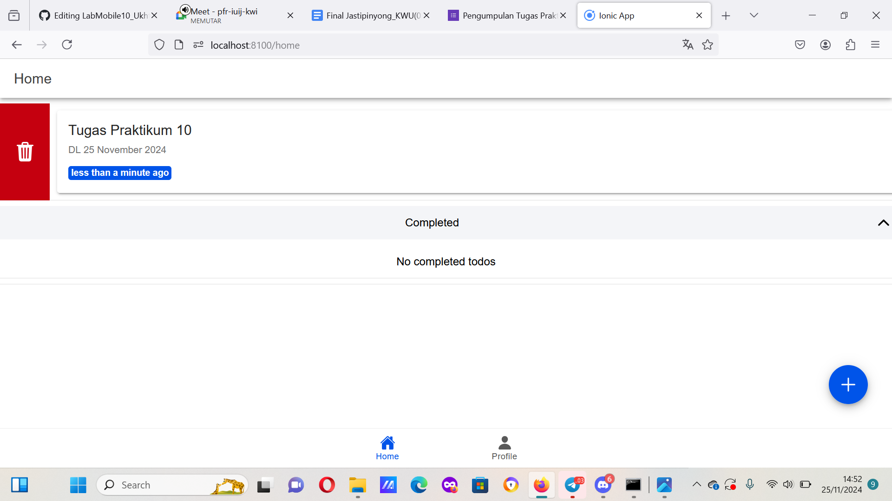
  // Handle Delete
const handleDelete = async (deleteTodo: Todo) => {
  try {
    await firestoreService.deleteTodo(deleteTodo.id!);
    await showToast("Todo deleted successfully", "success", checkmarkCircle);
    loadTodos();
  } catch (error) {
    await showToast("Failed to delete todo", "danger", closeCircle);
    console.error(error);
  }
};
  Kode handleDelete adalah sebuah fungsi asinkron yang bertugas untuk menghapus item "Todo" tertentu dari sistem. Fungsi ini menerima satu parameter, yaitu deleteTodo yang merepresentasikan data todo yang akan dihapus. Di dalam fungsi ini, proses penghapusan dilakukan melalui metode deleteTodo dari firestoreService, sebuah layanan yang berinteraksi dengan database Firestore. Properti id dari objek deleteTodo digunakan untuk mengidentifikasi todo yang akan dihapus, dan tanda seru (!) menandakan bahwa id tidak boleh bernilai undefined atau null.
Setelah operasi penghapusan berhasil, fungsi ini menampilkan notifikasi keberhasilan menggunakan showToast, dengan pesan "Todo deleted successfully", warna "success", dan ikon checkmarkCircle. Fungsi showToast bertanggung jawab untuk menampilkan pesan tersebut kepada pengguna, memberikan feedback langsung bahwa operasi telah berhasil. Setelah itu, fungsi loadTodos dipanggil untuk memuat ulang data todo dari database dan menyinkronkan daftar todo di tampilan pengguna. Hal ini penting untuk memastikan bahwa tampilan aplikasi tetap konsisten dengan data terbaru di backend.
Namun, jika terjadi kesalahan selama proses penghapusan, kode di dalam blok catch akan dijalankan. Dalam situasi ini, showToast dipanggil untuk menampilkan pesan kesalahan "Failed to delete todo" dengan warna "danger" dan ikon closeCircle, memberikan informasi kepada pengguna bahwa ada masalah dalam penghapusan todo. Kesalahan juga dicatat dalam konsol menggunakan console.error, yang berguna untuk debugging. Dengan cara ini, fungsi ini dirancang untuk menangani operasi penghapusan dengan baik, termasuk memberikan umpan balik yang sesuai kepada pengguna, baik dalam kasus sukses maupun gagal.
  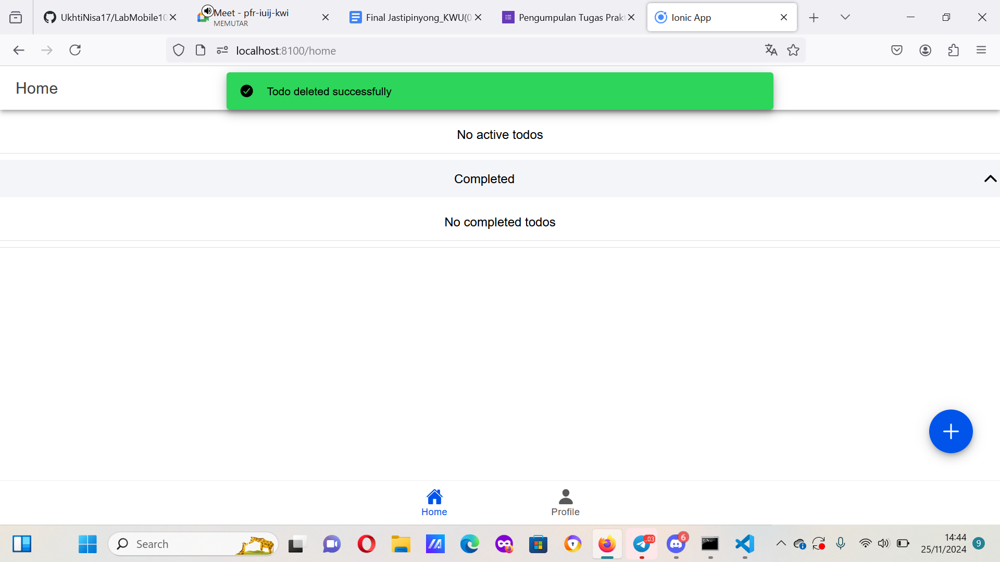
